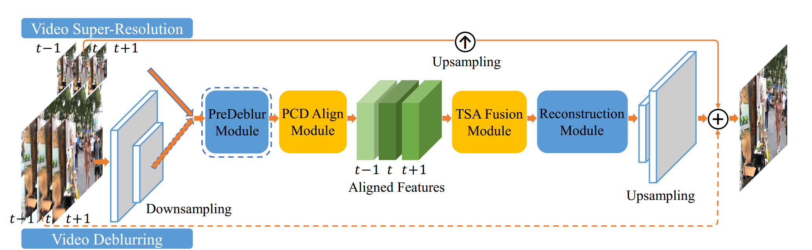
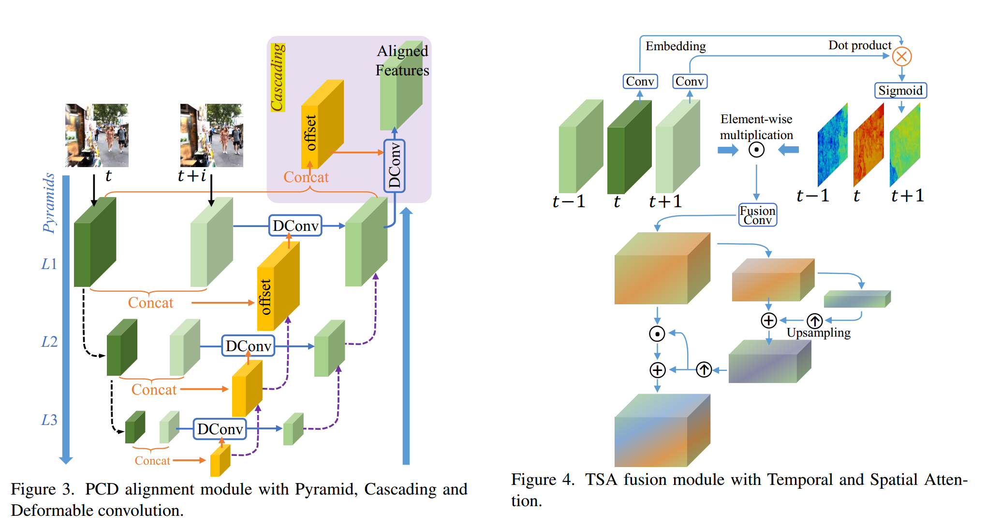
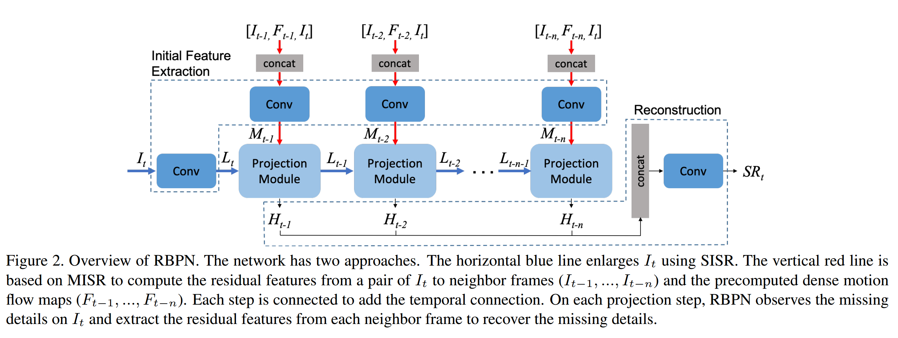
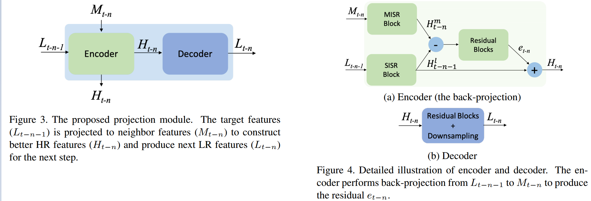

[toc]

## video benchmark

list some papers first

### 2020

### 2019

#### [1] EDVR: Video Restoration with Enhanced Deformable Convolutional Networks

* a Pyramid, Cascading and Deformable (PCD) alignment module
* Temporal and Spatial Attention (TSA) fusion module

#### [2] RBPN: Recurrent Back-Projection Network for Video Super-Resolution

* Temporal context is organized by a recurrent process using the idea of **(back)projection**, yielding gradual refinement of the high resolution features used, eventually, to reconstruct the high resolution target frame

